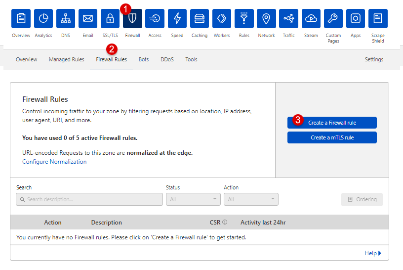
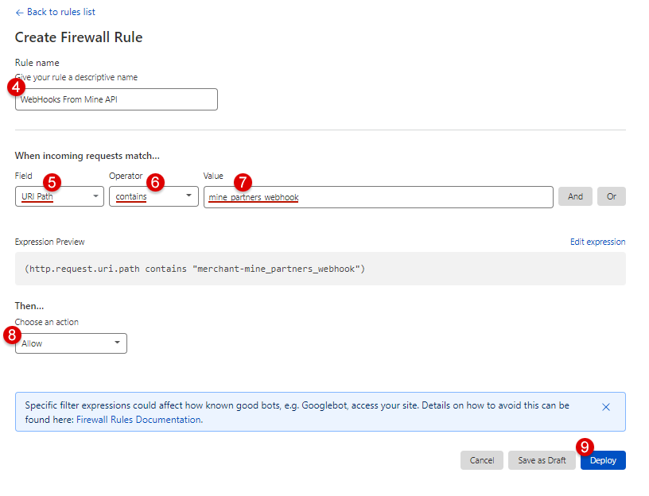

# ℹ Настройка исключений для WebHook URL в Cloudflare

## 1. Авторизоваться в Cloudflare и выбрать ваш домен, с которым вы будете производить манипуляции;

## 2. Перейти к созданию правила Firewall
<kbd></kbd>

## 3. Добавить правило "URI Path - contains - mine_partners_webhook" (Allow) и сделать Deploy
<kbd></kbd>

## 4. Подождать примерно 5 минут, т.к. вступление правил в силу происходит не сразу

> ⚠ Если всё ещё есть проблема с доставкой вебхуков, проверьте что Bot Fight Mode отключен на данный домен (Firewall -> Bots -> Bot Fight Mode)